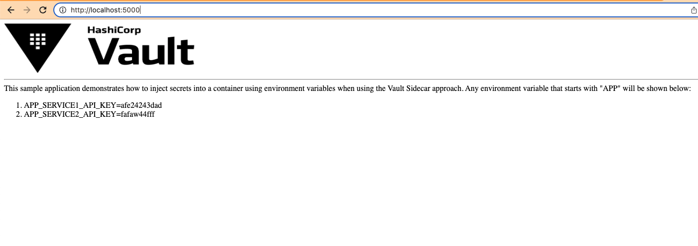

# HelloVault Sample App

## Build Image (optional)
```
docker build  -t mackhendricks/hellovault .
```

## Test Image 
Test with Docker
```
docker run -p 5000:5000 --env APP_SERVICE1_API_KEY=afe24243dad --env APP_SERVICE2_API_KEY=fafaw44fff mackhendricks/hellovault
```

## Deploy on Kubernetes
```
kubectl apply --filename k8s/pod-hellovault-with-annotations.yaml --namespace <<yournamespace>>
```

## Screenshot of App

